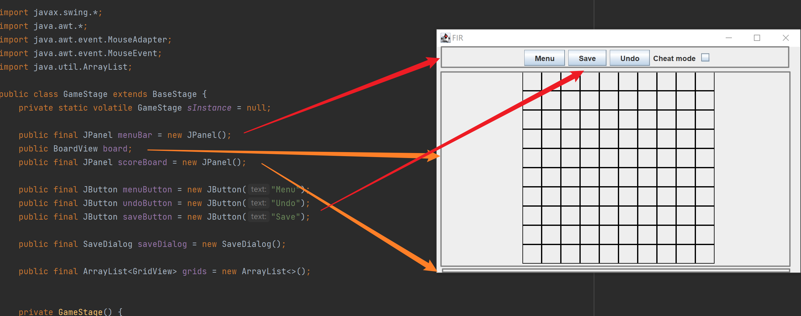
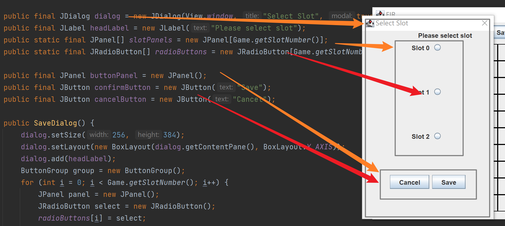

# 游戏界面

布局是BoarderLayout，东西两边是空的，有需要可以自己往里放JPanel。

下边的ScoreBoard是个空的JPanel。

cheat mode是样例在main函数里加的。

不要直接修改board，用View里那个setBoardViewPattern方法。

## SaveDialog

点击Save按钮后弹的框。

布局是BoxLayout。

saveDialog是在View.Start()时初始化的，这个之后会改。。。如果要改里面的组件记得先init。
