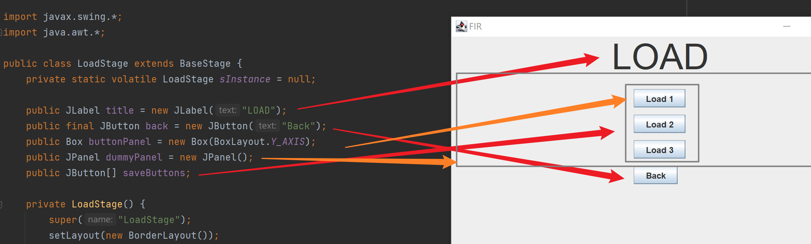

# 加载页

基本内容和MenuStage一样，除了按钮。

现在比截图里的东西多了一个`LoadFailedMessageBuilder`，用来自定义加载失败的消息。  
是个传入Exception返回String的lambda。

按钮也多了一个select file，用于手动选择存档文件。

按钮是在View.start()时生成的，所以如果要修改样式需要在此之后修改，否则会发生空指针错误。