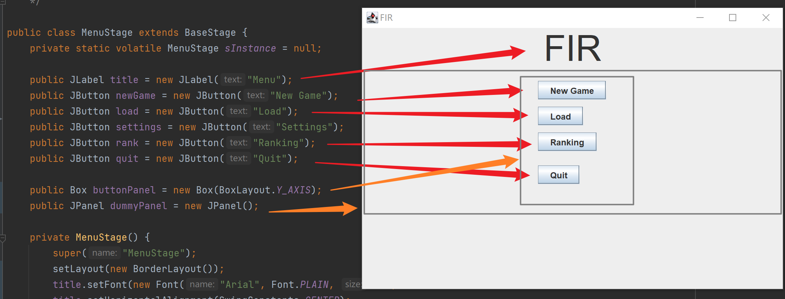

# 菜单页

每一个JButton的功能是跳转到对应的Stage。

有一个不显示的Settings按钮，跳转到我没写的SettingStage。有需要可以自己实现。

整个MenuStage的布局是是BorderLayout，buttonPanel和dummyPanel的布局为默认（注意buttonPanel是Box，Box的默认布局是BoxLayout）。

按钮之间的间距是10。

title的字体是new Font("Arial", Font.PLAIN, 50)。