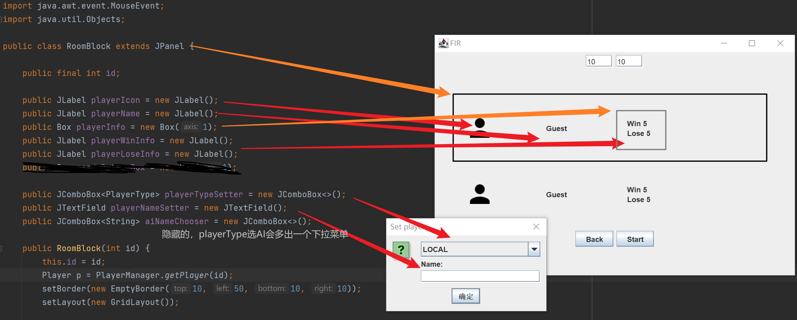

# 房间


布局是BoxLayout。

上面两个文本框是用来设置棋盘宽高的。不需要可以直接隐藏掉。

RoomBlock见下文。

## RoomBlock

每一个RoomBlock代表一个玩家框。



布局是GridLayout。接受PlayerChangeEvent，每次收到会更新玩家姓名和胜场。

此外，RoomBlock也可以通过setCustomDrawMethod(Procedure)设定样式。具体见Stage的文档。

这个方法和Stage有一些区别。首先，它是static的，其次，Stage中这个函数传入的lambda没有参数，这里传入的lambda带一个类型为RoomBlock的参数，
当`this`用就可以。
贴一下默认的绘制方法：
```java
(RoomBlock roomBlock) -> {
        roomBlock.playerInfo.add(Box.createVerticalGlue());
        roomBlock.playerInfo.add(roomBlock.playerWinInfo);
        roomBlock.playerInfo.add(roomBlock.playerLoseInfo);
        roomBlock.playerInfo.add(Box.createVerticalGlue());

        roomBlock.add(roomBlock.playerIcon);
        roomBlock.add(roomBlock.playerName);
        roomBlock.add(roomBlock.playerInfo);
    };
```
